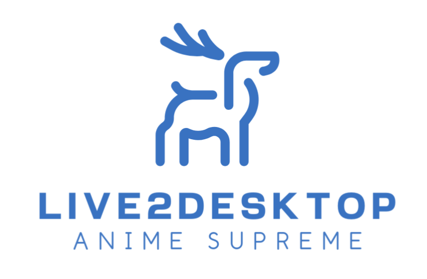

# Live2Desktop



**A desktop application for Live2D model management and interaction based on Qt.**

<a href="README_zh_CN.md">中文 README</a>


## ⚠️ Note: WIP

- The current branch is under development and may have stability issues. If you want a more stable version, go back to the `stable` branch.

- There are no compilations from this branch in Release. If you want to try a program from this branch, compile it yourself.


## Functionality 

- Live2D display and limited interaction; 
    - Adding models: Please place the model directory in the `Resources` directory (`Hiyori` is given as an example in the source code), and add the model name manually in `Resources/config.json`.

    - Managing model expressions and actions: Managing model expressions and actions can be found in the `settings` graphical interface in the program tray.

    - Model Geometry Adjustment: See `Geometry Edit` in the program tray for the size and position of the model display.

    - Model interaction: For the time being, two types of actions are supported: dragging and tapping. Dragging the mouse in the geometry area of the program (which can be edited by `Geometry Edit`) can attract the model's attention; tapping the model to display random expressions and actions.

- Speech to Client, AI Agent output to speech (configuration required, see below); 

- OpenAI Chat (configuration required, see below); 

- No need to open a dialog box, global hotkey recording (CTRL+SHIFT+R, press again to stop and submit), large model output voice response.


## Possible future support 

- MCP (Model Context Protocol) adaption, or other ways to implement multimodal, function calling; 

- Graphically set up rather than manually editing the JSON files for these sections: speech to text, text to speech, AI conversations;

- Digital People; 

- More in [TODO file](./TODO).


## Update Log

- 2024/02/14: Live2Desktop de-coupled Live2D official `glfw / glew` and migrated to Qt Platform (`QOpenGLWidget`);

- 2024/07/29: Updated Live2Desktop's Live2D Core to `5-r.1` version. May support moc3 as `5.0`, not tested.

- 2024/08/19: Updated `Framework/Rendering` of Live2Desktop, synchronization of Framework code interface with `5-r.1` completed, backup directory removed.

- 2025/03/28: Updated voice, chat features (WIP).

## Background

As we all know, Live2D model display and interaction on Windows platform relies on Live2DViewerEx paid application, while Linux platform is rarely known. This application aims to build a lightweight, cross-platform desktop application for displaying and interacting with Live2D models based on the official Live2D Cubism SDK and Qt framework.

In addition, the official Cubism SDK uses glew / glfw linked libraries, **not only is it not good for application platform migration, but also can't use the latest `QOpenGLWidget` in Qt framework (header file conflict), and it's difficult to realize a lot of features (e.g., background transparency)**, which may cause a lot of trouble to the developer.

This application starts from the perspective of **modifying the official SDK**, and does things like replacing glew with Qt's built-in `OpenGL` functions, which provides a new way to develop Live2D in the Qt framework.


## Configure the Chat Model 

Any model service that supports the OpenAI API will work. Please modify `config/mcp_config.json` in the repository directory before compiling (CMake will copy it to the runtime directory), or modify `build/bin/config/mcp_config.json` after compiling;

Don't forget to compile the project after modifications.

As the project is under development and I don't have enough time to write GUI, please forgive me :(

## Configure speech-to-text and text-to-speech for Chat Model 

For performance reasons, this project uses sense-voice local inference for speech-to-text.

Since this project is still under development, you need to manually execute `./get_model.sh` or manually download any model from [huggingface](https://huggingface.co/lovemefan/sense-voice-gguf) and put it into `build/bin/models` (or create it manually if it doesn't exist).

Then in `config/module_config.json` change the filename in `stt -> model` to replace it with the name of your model file.

Now the speech-to-text feature is configured.

This project currently uses a web service solution to support text-to-speech. You can choose any speech-to-text model service that follows the OpenAI API, and fill in the `tts` subsection of `config/module_config.json` with the full URL and API information.

> Example: you can use [Kokoro FastAPI](https://github.com/remsky/Kokoro-FastAPI.git) to run a docker container on your machine, and fill in the configurations.

The text-to-speech functionality is now configured.

It is expected that in the future, both of these will be handled in a unified manner, so you won't need to do this manually.

Don't forget to compile the project after modifications.


## Quick Start

Obtain this repo & submodules:

```bash
git clone https://github.com/SSRVodka/Live2Desktop
git submodule sync && git submodule update --init --recursive
```

Then you can download the compiled binaries from the Release or compile them yourself.

Before compiling, you need to prepare the following development environment:

- C++ development kit: Only `build-essential` is needed for Unix platform, and MSVC compiler and corresponding development environment are needed for Windows platform;

- CMake;

- Qt 5 development framework (Qt 5.15).


> Please note that the version of Qt should not be too low, and the `QOpenGLWidget` feature needs to be supported.


The compilation commands for Unix are as follows:

```bash
cmake -B build && cd build && make -j
# or
cmake -B build && cmake --build build
```

By default `CMAKE_BUILD_TYPE=Release`. You can pass in the `-DDEBUG=ON` macro to build the Debug version, adding the GDB debugging symbols. For example: 

```bash 
cmake -B build -DDEBUG=ON 
cd build 
make -j 
```

This project references ggml, and if your machine supports BLAS, you can add the argument `-DGGML_BLAS=ON`.

Dependency libraries are compiled as dynamic link libraries by default. If you want to replace it with a static library, please use `-DBUILD_SHARED_LIBS=OFF` and debug it yourself.

The default program output is in `${CMAKE_BINARY_DIR}/bin/` directory, and the link library output is in `${CMAKE_BINARY_DIR}/lib/` directory.


## Compatibility Test

- Windows: Windows 10, MSVC 19+, CMake 3.16, Qt 5.15

- Linux: Ubuntu 22.04, gcc/g++ 12, CMake 3.22.1, Qt 5.15.3


## Declaration

The source files (`*.h/*.hpp`) begin with the statement `Live2D Cubism Inc.` The source code is copyrighted by that company.

Statements `@Author SSRVodka` follow the license of this project.


## Credits

- [nlohmann/json.hpp](https://github.com/nlohmann/json)

- [cpp-httplib](https://github.com/yhirose/cpp-httplib)

- [ggml](https://github.com/ggml-org/ggml)

