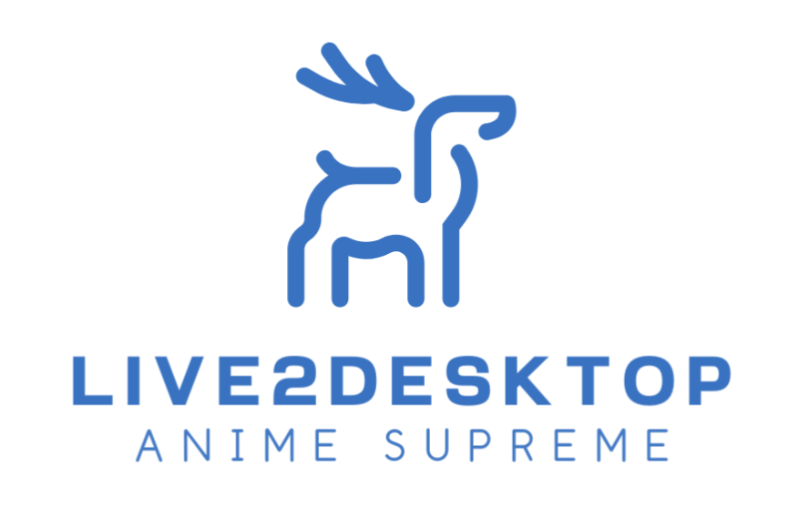

# Live2Desktop



**一个基于 Qt 框架的 Live2D 模型展示、互动的桌面应用。**


## 更新日志

- 2024/02/14：Live2Desktop 去除 Live2D 官方 `glfw / glew` 耦合，迁移至 Qt Platform（`QOpenGLWidget`）；

- 2024/07/29：更新 Live2Desktop 的 Live2D 内核为 `5-r.1` 版本。可能支持 moc3 为 `5.0` 的版本，并未进行测试。

- 2024/08/19：更新 Live2Desktop 的 `Framework/Rendering`，Framework 代码接口与 `5-r.1` 完成同步，移除备份目录；


## 背景

众所周知，Live2D 模型在 Windows 平台下的展示与互动依托于 Live2DViewerEx 收费应用，而 Linux 平台则鲜有闻之。本应用旨在依托于 Live2D Cubism 官方 SDK 和 Qt 框架，建立起一个轻量级、跨平台的 Live2D 模型展示、互动的桌面应用。

此外，官方 Cubism SDK 使用 glew / glfw 链接库，**不仅不利于应用平台迁移，在 Qt 框架下还无法使用最新的 `QOpenGLWidget`（头文件冲突），很多特性难以实现（例如背景透明）**，可能给开发者带来不少麻烦。

本应用从**修改官方 SDK 的角度**出发，进行诸如将 glew 替换为 Qt 内置 `OpenGL` 函数之类的操作，为 Live2D 在 Qt 框架下的开发提供一种全新的开发途径。

## 功能

- 添加模型：请自行向 `Resources` 目录下放置模型目录（源码中给了 `Hiyori` 作为例子），在 `Resources/config.json` 中手动添加模型名称即可。

- 模型的表情、动作管理：模型的表情、动作等信息管理见程序托盘 `settings` 图形界面。

- 模型几何性质调整：模型展示的大小、位置参见程序托盘 `Geometry Edit`。

- 模型互动：暂时支持拖动、轻点两种动作。在程序的几何区域内（可以通过 `Geometry Edit` 自行编辑）拖动鼠标可以吸引模型视线；轻点模型随机展示表情、动作。


## 快速开始

下拉本仓库及子模块：

```bash
git clone https://github.com/SSRVodka/Live2Desktop
git submodule sync && git submodule update --init --recursive
```

接下来，您可以从 Release 中下载已经编译好的二进制文件，也可以自行编译。

在编译前，您需要准备以下开发环境：

- C++ 开发套件： Unix 平台下仅需要 `build-essential`，Windows 平台需要安装 MSVC 编译器及对应开发环境；

- CMake；

- Qt 5 开发框架（Qt 5.15）。


> 请注意，Qt 的版本不宜过低，需要支持 `QOpenGLWidget` 特性。


Unix 下的编译指令如下：

```bash
cmake -B build && cd build && make -j
# 或者
cmake -B build && cmake --build build
```

默认情况下 `CMAKE_BUILD_TYPE=Release`。您可以传入 `-DDEBUG=ON` 的宏来编译 Debug 版本，例如：

```bash
cmake -B build -DDEBUG=ON
cd build
make -j
```

此外还提供 `BUILD_SHARED_LIBS` 选项，您可以选择链接第三方的动态链接库，还是静态链接库，默认静态链接库。例如：

```bash
cmake -B build -DBUILD_SHARED_LIBS=ON
cd build
make -j
```

默认程序输出位置在 `${CMAKE_BINARY_DIR}/bin/` 目录下。

## 兼容性测试

- Windows: Windows 10, MSVC 19+, CMake 3.16, Qt 5.15

- Linux: Ubuntu 22.04, gcc/g++ 12, CMake 3.22.1, Qt 5.15.3

## 声明

源文件（`*.h/*.hpp`）开头注明 `Live2D Cubism Inc.` 的源码解释权归该公司所有。

注明 `@Author SSRVodka` 的遵循本项目许可证。
